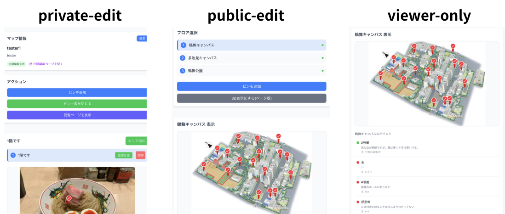
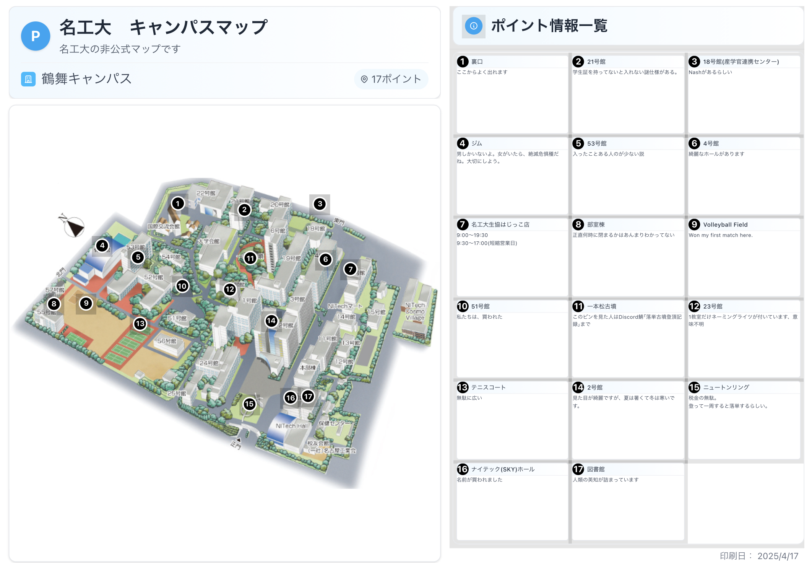
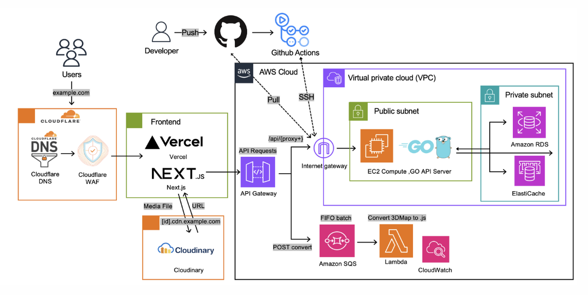

# pamfree.com


**パンフレットは「作る」から「共有」する時代へ。**

このモットーに基づき、既存の地図やフロアプランを活用して、地図上にピンを指し、詳細一覧をたくさんの人で書き込める共有型パンフレットに変換できるサービスを開発しました。

Pamfreeのアイコンは、ピンを意識して描かれています。

アイコンは、ひつじくん[(sheeplab.net)](https://sheeplab.net/)による制作です。大感謝です。

<Br/>

## 何ができるの？

このサービスは、既存のマップからハッカソンのブース展示まで多岐に渡る活用を想定しており、視覚的にわかりやすく、情報を効果的に伝えられるようになっています。

やり方は、画像を挿入し、ピンを刺すだけ。ピンを押すと情報が表示され、ピン一覧から情報を押すことで、ピンの位置を示してくれることもできます。


<Br/>

## ニーズに合わせた編集モード

編集モードは用途に応じて切り替え可能で、自分だけが編集できるプライベートモード、複数人でリアルタイムに編集できる共同編集モード、内容を固定して閲覧のみ可能なモードを用意しています。




<Br/>

## しおり機能

また、置いたピンをもとに、しおりを作ることができます。
作ったしおりは、そのまま印刷できるようになっています。




<Br/>

# アップデート情報

## ver 1.1

公開編集機能を追加。みんなで作業ができるように。

## ver 1.2

バックエンドをGoに移し、サーバーはAWSを使用して高速化。
アーキテクチャを大幅改善、CDNを導入して高速化。



## ver1.3

印刷機能を追加、toBに対応できるようにしました。

## ver1.3.1

faviconを変更しました。PamfreeのPがiconになっています。

## tree

構成は以下の通りです。

```
48 directories, 46 files

.
├── account
│   └── page.tsx
├── admin
│   └── users
│       └── page.tsx
├── api
│   ├── account
│   │   ├── change-password
│   │   │   └── route.ts
│   │   └── update-profile
│   │       └── route.ts
│   ├── admin
│   │   └── users
│   │       ├── [userId]
│   │       │   └── route.ts
│   │       └── route.ts
│   ├── auth
│   │   ├── [...nextauth]
│   │   │   └── route.ts
│   │   └── register
│   │       └── route.ts
│   ├── floors
│   │   └── [floorId]
│   │       ├── image
│   │       │   └── route.ts
│   │       ├── pins
│   │       │   └── route.ts
│   │       └── route.ts
│   ├── maps
│   │   ├── [mapId]
│   │   │   ├── floors
│   │   │   │   └── route.ts
│   │   │   └── route.ts
│   │   ├── by-map-id
│   │   │   └── [mapId]
│   │   │       └── route.ts
│   │   └── route.ts
│   ├── pins
│   │   └── [pinId]
│   │       └── route.ts
│   ├── public-edit
│   │   ├── pins
│   │   │   ├── [pinId]
│   │   │   │   └── route.ts
│   │   │   └── route.ts
│   │   ├── register
│   │   │   └── route.ts
│   │   └── verify
│   │       └── route.ts
│   └── viewer
│       └── [mapId]
│           └── route.ts
├── apple-icon.png
├── assets
│   └── NotoSansJP-Bold.ttf
├── dashboard
│   └── page.tsx
├── favicon.ico
├── globals.css
├── icon0.svg
├── icon1.png
├── layout.tsx
├── login
│   └── page.tsx
├── logo.svg
├── manifest.json
├── maps
│   └── [mapId]
│       └── edit
│           └── page.tsx
├── page.tsx
├── pamphlet
│   └── page.tsx
├── privacy
│   └── page.tsx
├── proposal
│   ├── page.tsx
│   ├── price
│   │   └── page.tsx
│   ├── pro
│   │   └── page.tsx
│   └── pro222
│       └── page.tsx
├── public-edit
│   └── page.tsx
├── register
│   └── page.tsx
├── terms
│   └── page.tsx
└── viewer
    ├── logo.svg
    ├── p.png
    └── page.tsx
```
